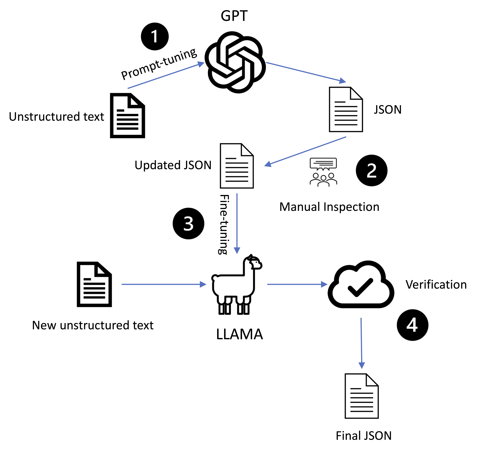

# Application of Large Language Models in Chemistry Reaction Data Extraction and Cleaning
### Abstract
In the realm of chemistry, literature texts elucidating chemical reactions are crucial for tasks such as yield prediction, reaction prediction, and reaction condition recommendation. However, extracting structured data from these texts is challenging. Our paper explores the use of Large Language Models (LLMs) to process unstructured chemical reaction data. We manually curated a dataset to fine-tune LLMs, including LLAMA-2 and GPT models, and employed techniques like prompt-tuning and fine-tuning. Our results show that prompt-tuning GPT-4 yields the highest accuracy. We also introduced a verification step using external APIs to authenticate extracted data. This work demonstrates the potential of LLMs in enhancing data-driven chemistry.
### Setup
#### Llama Prompt-tuning
Please go for the [prompt-tuning/llama](https://github.com/joker-bruce/LLM_Extraction_Chem/tree/main/prompt_tuning/llama) folder for more details
#### GPT Prompt-tuning
Please go for the [prompt-tuning/GPT](https://github.com/joker-bruce/LLM_Extraction_Chem/tree/main/prompt_tuning/GPT) folder for more details
#### LLama finetuning
Please go for the [finetuning](https://github.com/joker-bruce/LLM_Extraction_Chem/tree/main/finetuning) folder for more details.  
Go to [Meta Llama download link](https://llama.meta.com/llama-downloads/) to download models and place them into `models` folder

### Pipeline

### Result
| **Tuning Type** | **Model & Prompt Type** | **SacreBLEU** | **BLEU-1** | **ROUGE-1** | **ROUGE-2** | **ROUGE-L** |
|-----------------|-------------------------|---------------|------------|-------------|-------------|-------------|
| **Prompt-tune** | **LLAMA2-7b No-prompt**  | 14.86         | 0.07       | 0.10        | 0.07        | 0.09        |
|                 | **LLAMA2-13b No-prompt** | 13.88         | 0.03       | 0.50        | 0.37        | 0.40        |
|                 | **LLAMA2-70b No-prompt** | 10.38         | 0.03       | 0.35        | 0.23        | 0.26        |
|                 | **LLAMA2-13b Moderate**  | 24.50         | 0.03       | 0.53        | 0.33        | 0.43        |
|                 | **LLAMA2-70b Moderate**  | 17.20         | 0.03       | 0.48        | 0.29        | 0.41        |
|                 | **LLAMA2-13b Expert**    | 47.41         | 0.03       | 0.63        | 0.43        | 0.55        |
|                 | **LLAMA2-70b Expert**    | 50.00         | 0.03       | 0.66        | 0.48        | 0.59        |
|                 | **GPT3.5-turbo Expert**  | 75.22         | 0.16       | 0.83        | 0.73        | 0.74        |
|                 | **GPT4.0 Expert**        | **98.62**     | **0.45**   | **0.98**    | **0.98**    | **0.98**    |
| **Fine-tune**   | **GPT3.5-turbo**         | _84.14_       | _0.20_     | _0.89_      | _0.83_      | _0.85_      |
|                 | **LLAMA2-7b**            | 41.36         | 0.05       | 0.62        | 0.58        | 0.58        |
|                 | **LLAMA2-13b**           | 77.50         | 0.04       | 0.83        | 0.75        | 0.77        |

**Table 1**: Comparison of models with different parameters and tuning methods under BLEU and ROUGE metrics. The GPT4.0 Expert Prompt-tuning and GPT3.5 finetuning yield the best and the second best result, respectively, across each metric.

| **Tuning Type** | **Model & Prompt Type** | **A** | **B** | **C** |
|-----------------|-------------------------|-------|-------|-------|
| **Prompt-tune** | **GPT4.0 Expert**       | **0.98** | 0.59  | 0.56  |
| **Fine-tune**   | **GPT3.5-turbo**        | 0.98  | 0.26  | 0.22  |
|                 | **LLAMA2-7b**           | 0.96  | **0.62** | **0.60** |
|                 | **LLAMA2-13b**          | 0.97  | 0.56  | 0.52  |

**Table 2**: Verification scores of different model types. Metric A: Proportion of valid SMILES; Metric B: Proportion of correctly verified mole values; Metric C: Average yield estimation correctness.
###

